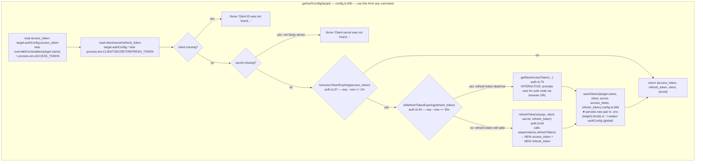
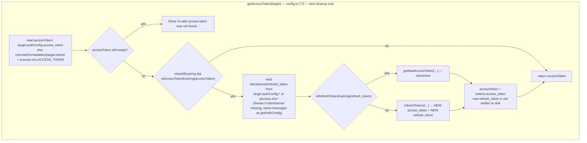
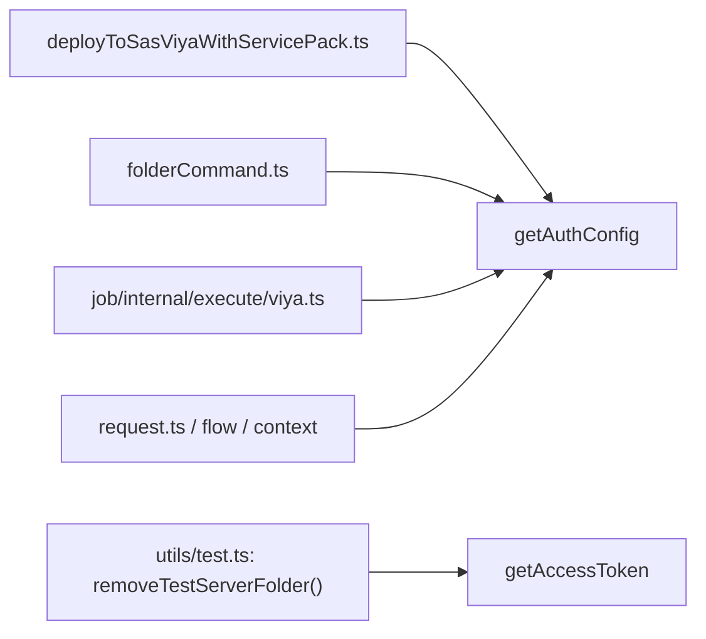

# Access/refresh token & auth config logic (SAS Viya)

Scope: `src/utils/auth.ts`, `src/utils/config.ts`. Two entry points resolve
credentials for a `Target`; they differ in one critical way (persistence). Read the
"Critical invariant" section before touching either.

## Entry points comparison

## Callers

## Critical invariant

- **Any code path that can be invoked again in a later, separate process** (i.e. any
  real CLI command) **must persist a refreshed token pair** — use `getAuthConfig()`.
  SAS Viya issues single-use, rotating refresh tokens: every `refreshTokens()` call
  invalidates the refresh token it was given and returns a new one, so the new pair
  has to be written back to disk or the next invocation has nothing valid to use.
- **`getAccessToken()` never persists.** Safe only for same-process, one-shot use that
  nothing else depends on afterward — currently only `removeTestServerFolder()` in
  `src/utils/test.ts:94` (test cleanup).
- Expiry thresholds: access token refreshed if `exp - now <= 3600s` (1hr);
  refresh token considered dead if `exp - now <= 30s`.
- If the refresh token is dead, both entry points fall back to `getNewAccessToken()`,
  which is **interactive** (prints a URL, prompts for an auth code) — unsuitable for
  unattended/CI use.
- Persistence target depends on where the target lives: local `sasjsconfig.json` →
  writes `.env.{targetName}`; global `~/.sasjsrc` → writes into that target's
  `authConfig` object directly (`saveTokens`, config.ts:684).
