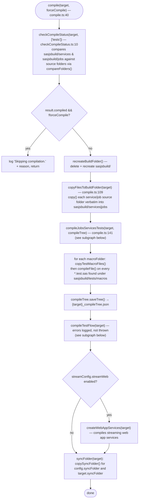
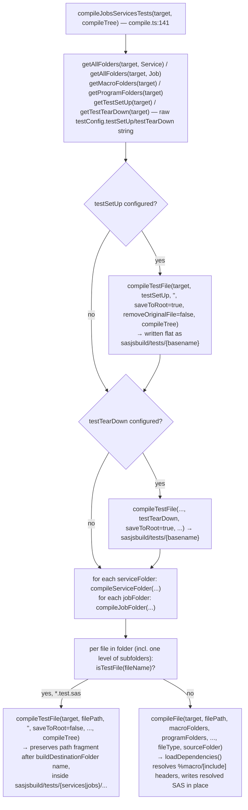
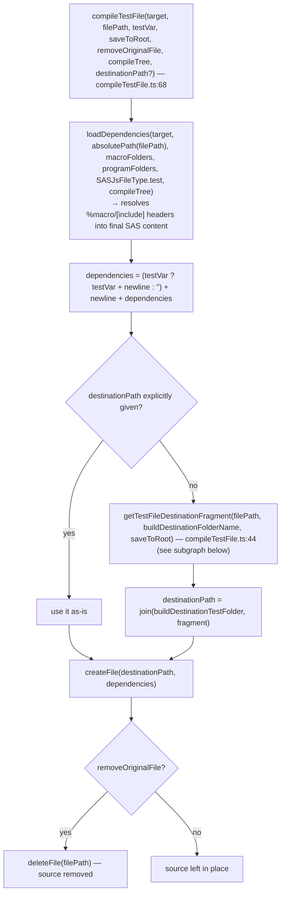
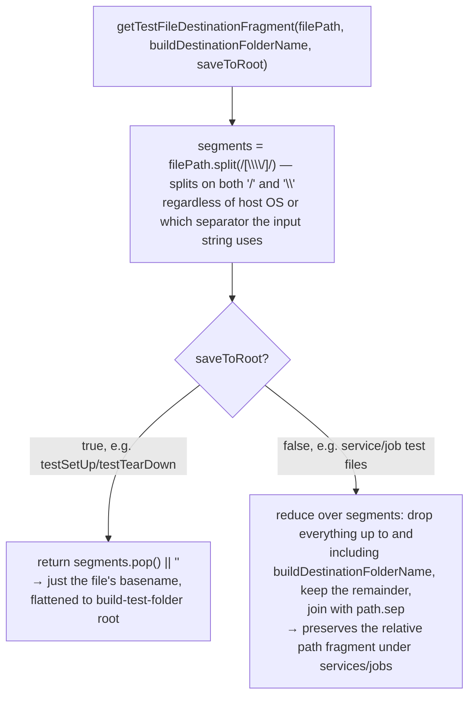
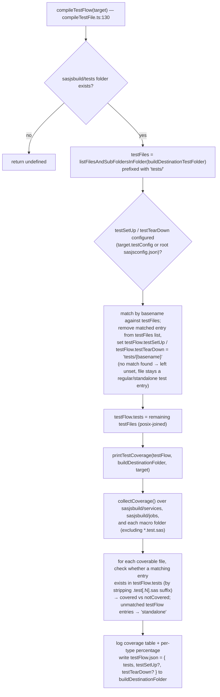

# `sasjs compile` (`sasjs c`) logic

Scope: `src/commands/compile/compile.ts`, `src/commands/compile/internal/*`. Entry
point is `compile(target, forceCompile)` at `compile.ts:40`.

## Top-level flow

## `compileJobsServicesTests` — per-file dispatch

## `compileTestFile` — destination path resolution

## `compileTestFlow` — building `testFlow.json` + coverage

## Key facts

- `checkCompileStatus` can make `compile()` a no-op: it diffs source vs already-compiled
  output folder-by-folder (`compareFolders`) and skips work entirely unless
  `forceCompile` is passed or something actually changed.
- `testSetUp`/`testTearDown` are compiled once, flattened to the root of
  `sasjsbuild/tests/` (`saveToRoot = true`); all other `*.test.sas` files found under
  service/job folders are compiled with their relative path preserved under
  `sasjsbuild/tests/{services|jobs}/...` (`saveToRoot = false`). Both paths go through
  `getTestFileDestinationFragment(filePath, buildDestinationFolderName, saveToRoot)`
  in `compileTestFile.ts`, which splits on both `/` and `\` so the result doesn't
  depend on which separator style the input path happens to use.
- Macro test files (`*.test.sas` under any macro folder) are handled separately via
  `copyTestMacroFiles()` (copy into `sasjsbuild/tests/macros`, skipping files that
  already exist at the destination) + a second `compileFile()` pass to resolve their
  dependencies - this happens after `compileJobsServicesTests`, not inside it.
- `compileTestFlow` only ever *reads* whatever already landed in
  `sasjsbuild/tests` - it doesn't compile anything itself, it just assembles
  `testFlow.json` and prints/writes coverage. If a configured `testSetUp`/
  `testTearDown` doesn't match any actual compiled file by basename, it's silently
  left unset and the corresponding file (if any) is treated as a regular test.
- Dependency resolution (`%macro`/program includes) for every non-test file goes
  through `loadDependencies()` → `loadDependenciesFile()` (from `@sasjs/utils`), which
  is also memoized per-file via the `compileTree` (`{target}_compileTree.json`) to
  avoid recomputing dependencies across compiles.
- `loadDependencies()` resolves `%macro` calls against `macroFolders`/`programFolders`
  (from the target/config) plus `process.sasjsConstants.macroCorePath`, for macros from
  `@sasjs/core`. `macroCorePath` is computed once per run in `setConstants()`
  (`src/utils/setConstants.ts`), in this order: the `macroCorePath` env var if set,
  else `@sasjs/core` resolved starting from `process.projectDir` (the user's own
  project - via `getNodeModulePath('@sasjs/core', process.projectDir)`), else
  `@sasjs/core` resolved relative to `@sasjs/cli`'s own install location, as a
  fallback for projects that haven't installed `@sasjs/core` themselves.
