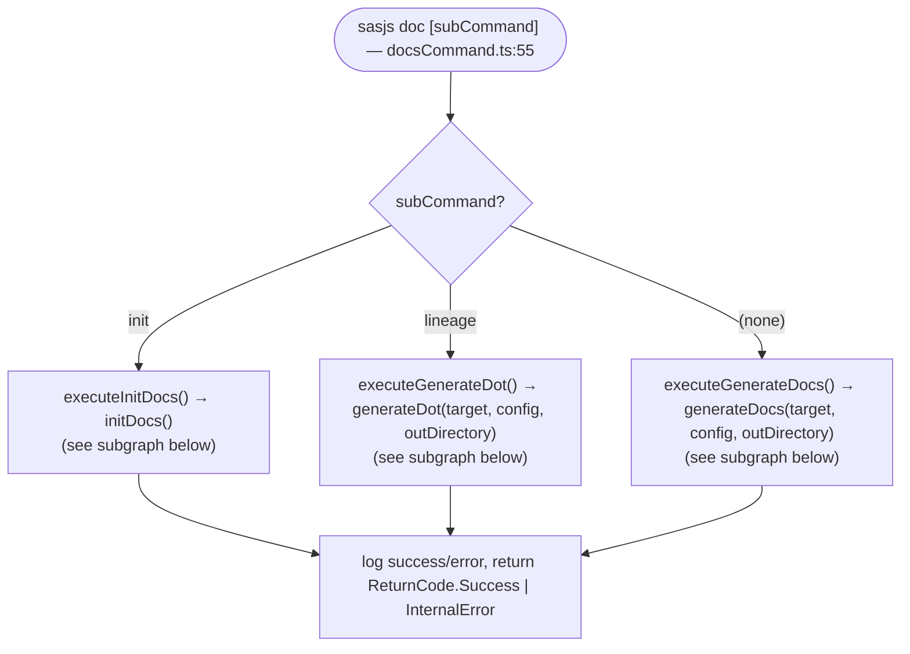
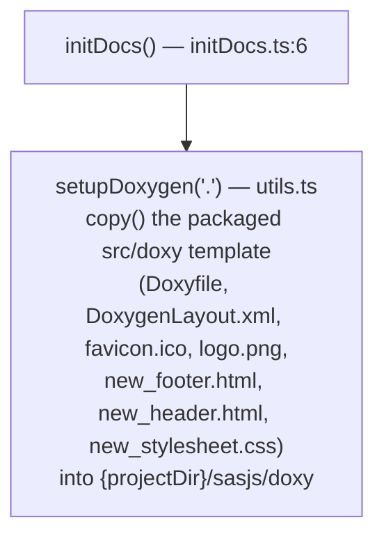
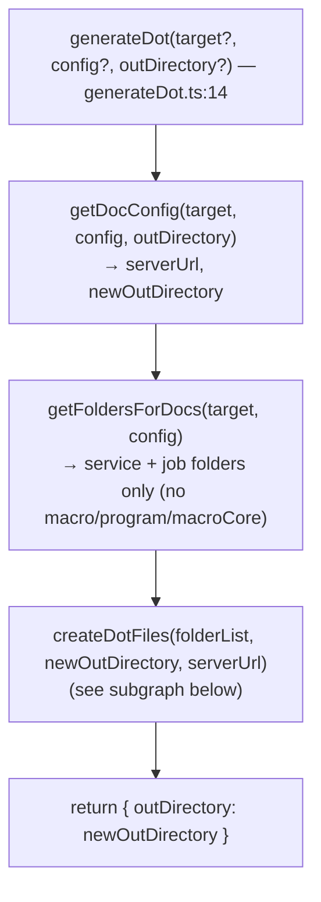
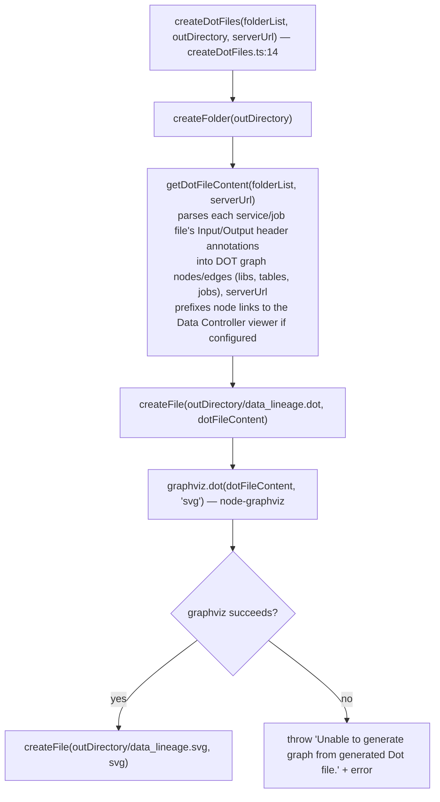

# `sasjs doc` logic

Scope: `src/commands/docs/docsCommand.ts`, `src/commands/docs/generateDocs.ts`,
`src/commands/docs/generateDot.ts`, `src/commands/docs/initDocs.ts`,
`src/commands/docs/internal/*`. Entry point is `DocsCommand.execute()` at
`docsCommand.ts:55`.

## Top-level dispatch

## `initDocs()` — scaffold the doxy folder

## `generateDocs()` — the default subcommand

```mermaid
flowchart TD
    A["generateDocs(target?, config?, outDirectory?) — generateDocs.ts:32"] --> B["getDocConfig(target, config, outDirectory)\nresolves: newOutDirectory (target > config > default),\nserverUrl (for lineage links), enableLineage (target > config > true),\ndoxyContent (config merged with target override)"]
    B --> C["getFoldersForDocs(target, config)\ncollects macroCore/macro/program/service/job folders,\ntarget-level entries appended to root-level entries\n(macroCore uses target's displayMacroCore only if explicitly set there)"]
    C --> D{"combinedFolders empty?"}
    D -->|yes| E["throw: 'Unable to locate folders for generating docs.'"]
    D -->|no| F["read {projectDir}/package.json for PROJECT_NAME / PROJECT_BRIEF\n(falls back to placeholder text if missing/unparseable)"]
    F --> G["merge doxyContent defaults (favIcon/footer/header/layout/logo/readMe/\nstylesheet/path=sasjs/doxy) with docConfig.doxyContent override;\nresolve doxyContent.path to absolute if overridden"]
    G --> H{"enableLineage?"}
    H -->|yes| I["LAYOUT_FILE = doxyContent.path/DoxygenLayout.xml, used as-is"]
    H -->|no| J["read DoxygenLayout.xml, strip the Lineage <tab> entry,\nwrite a timestamped tmp copy → LAYOUT_FILE"]
    I --> K
    J --> K["build readMePath = join(doxyContent.path, doxyContent.readMe);\nset DOXY_INPUT (readMePath + all folders), DOXY_MAINPAGE (readMePath),\nHTML_* / PROJECT_* / LAYOUT_FILE via setVariableCmd()\n(env-var-style shell prefix, OS-specific syntax)"]
    K --> L["getDoxyConfigPath(doxyContent.path)\nlooks for Doxyfile, then DoxyFile, doxyfile, doxyFile as fallbacks;\nthrows if none found"]
    L --> M["(re)create newOutDirectory"]
    M --> N["shelljs.exec('doxyParams doxygen configPath')\nnon-silent only when LOG_LEVEL=Debug"]
    N --> O{"!enableLineage?"}
    O -->|yes| P["delete the tmp LAYOUT_FILE created earlier"]
    O -->|no| Q
    P --> Q{"exec code !== 0?"}
    Q -->|yes, stderr starts with 'error: '| R["throw '\\n' + stderr"]
    Q -->|yes, other stderr| S["throw 'Doxygen application is not installed or configured...' + stderr"]
    Q -->|no| T{"enableLineage?"}
    T -->|yes| U["createDotFiles(service+job folders, newOutDirectory, serverUrl)\n(see createDotFiles subgraph)"]
    T -->|no| V
    U --> V["return { outDirectory: newOutDirectory }"]
```

## `generateDot()` — `sasjs doc lineage` subcommand

## `createDotFiles()` — lineage dot/svg generation

## Key facts

- `getDocConfig` establishes precedence rules used throughout: target-level
  `docConfig` wins over root `sasjsconfig.json` `docConfig`, which wins over
  built-in defaults. `enableLineage` defaults to `true` if neither specifies it.
- `getFoldersForDocs` behaves differently for the two generators:
  `generateDocs` includes macro/macroCore/program folders in addition to
  service/job folders (everything Doxygen needs to scan); `generateDot` only
  needs service/job folders (the only place lineage-relevant Input/Output
  annotations live).
- Doxygen itself is invoked as an external shell command (`doxygen`) - the whole
  `generateDocs` flow assumes it's installed and on `PATH`; a non-zero exit code
  is the only failure signal available, distinguished only by whether `stderr`
  happens to start with `error: ` (a specific Doxygen-side config error) versus
  anything else (treated as "not installed/configured").
- `enableLineage` controls two independent things: whether the Lineage tab
  appears in the generated Doxygen layout (via a stripped tmp copy of
  `DoxygenLayout.xml`), and whether `createDotFiles` runs afterward to produce
  `data_lineage.dot`/`.svg`. Both are gated by the same flag but are otherwise
  unrelated code paths.
- `getDoxyConfigPath` tries four case variants of the config filename
  (`Doxyfile`, `DoxyFile`, `doxyfile`, `doxyFile`) in that order and uses
  whichever is found first; it throws only if none exist.
- `initDocs` is purely a file-copy operation - it doesn't read or validate
  any existing project state, so re-running it resets `sasjs/doxy/` back to
  the packaged template.
